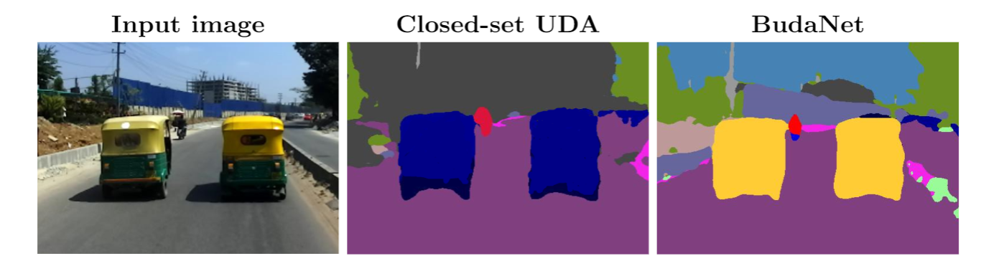

# BUDA: Boundless Unsupervised Domain Adaptation in Semantic Segmentation

The code will be published soon.

## Paper


[BUDA: Boundless Unsupervised Domain Adaptation in Semantic Segmentation](https://arxiv.org/)  
 [Maxime Bucher](https://maximebucher.github.io/), [Tuan-Hung Vu](https://tuanhungvu.github.io/) , [Matthieu Cord](http://webia.lip6.fr/~cord/), [Patrick Pérez](https://ptrckprz.github.io/)  
 valeo.ai, France  

If you find this code useful for your research, please cite our [paper](https://arxiv.org/pdf/):

```
@inproceedings{bucher2020buda,
  title={BUDA: Boundless Unsupervised Domain Adaptation in Semantic Segmentation},
  author={Bucher, Maxime and Vu, Tuan-Hung and Cord, Mathieu and P{\'e}rez, Patrick},
  booktitle={Arxiv},
  year={2020}
}
```
